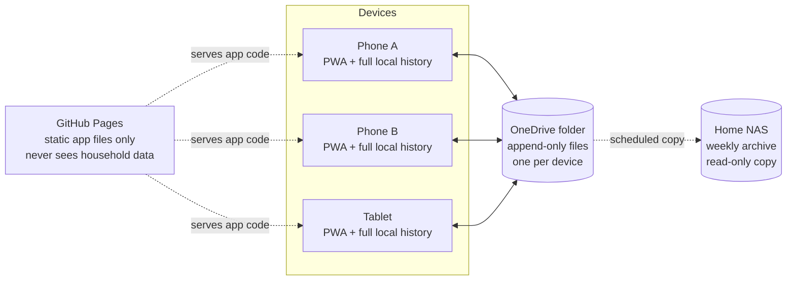

# The Fridge List — Architecture & Design

**Status:** Draft v0.1, 2026-09-13. Derived from [`URS.md`](URS.md) v0.1 and
[`SRS.md`](SRS.md) v0.1, and from an architecture interview with the
stakeholder on the same date.

This document says *how* the system is built. It is subordinate to `SRS.md`:
where this document and the SRS disagree, the SRS wins and this document is
wrong. Every significant decision below records the requirement that forced
it and the alternatives that were rejected, so that a future maintainer can
tell a deliberate choice from an accident.

The system has exactly one hard correctness guarantee — **FR-SYNC-1**, tick
durability. §5 exists to establish it, §6–§8 exist to avoid undermining it,
and §14 exists to check that it holds. Nothing else in this design is allowed
to cost it.

---

## 1. Architectural drivers

These are the facts that actually determined the shape of the system. Each
one closed off options; none is incidental.

| # | Driver | Source | Consequence |
|---|---|---|---|
| D1 | A tick, once recorded, must never revert except by explicit later human action | FR-SYNC-1 | Rules out any last-writer-wins-by-wall-clock merge (§5.4) |
| D2 | "The tick vanished" and "the list rebuilt and lost my tick" are the same failure to a user | Stakeholder, Round 5 | Regeneration may only *propose*, never *replace* (§5.7) |
| D3 | Ticks must also be *undoable* by a person who can see them | Stakeholder, Round 3 | Rules out a grow-only union; forces causal tracking (§5.4) |
| D4 | Zero infrastructure — no server the household runs or pays for | Stakeholder, Round 1 | Storage is a dumb file backend; no server-side logic, no transactions (§3) |
| D5 | Phones, in a supermarket, through brief signal loss | FR-SYNC-6, URS §6 | Local-first writes with a deferred upload queue (§7.4) |
| D6 | Staleness must be visible, per participating shopper | FR-SYNC-2, Stakeholder Round 3 | Presence heartbeats and an explicit roster (§8.2) |
| D7 | Single maintainer, maintained by hand or with an LLM, for years | Stakeholder, Round 4 | No build step, no runtime dependencies (§13) |
| D8 | 638 recipes / 452 ingredients / ~1 MB of existing data to import | Supplied data files | Library is fetched conditionally, never re-polled wholesale (§7.3, §12) |
| D9 | Verification is a one-off exercise, not a maintained CI burden | Stakeholder, Round 4 | Property-based tests written once, kept, run on demand (§14) |
| D10 | Data must remain the household's if the backend disappears | Stakeholder, Rounds 2 & 7 | Every device holds the complete history; backend is a courier (§15) |

### 1.1 Decisions at a glance

| Decision | Choice |
|---|---|
| Deployment shape | Installable PWA, static files, no build step |
| App hosting | GitHub Pages (HTTPS, free, already familiar) |
| Data backend | A single shared OneDrive folder, via Microsoft Graph |
| Topology | No authority anywhere; devices coordinate through shared files |
| State model | Append-only event log, one file per device, merged on read |
| Concurrency control | Version vectors (causal), never wall-clock ordering |
| Tick/untick rule | True-wins on concurrency; an untick counts only if it saw the tick |
| Library edit rule | Last-save-wins, deterministically tie-broken |
| Regeneration | Additive only; never writes over an existing line's state |
| Identity | One shared Microsoft login; anonymous per-device id + nickname |
| Language / tooling | Vanilla ES modules; dev-only test dependencies |
| Verification | Property-based testing of the merge engine (5 invariants) |
| Retention | Trip history 2 years; shop logs compacted and deleted at close |
| Backup | Weekly copy of the OneDrive folder to the household NAS |

---

## 2. System context



Two properties of this picture matter more than the boxes:

1. **GitHub Pages never touches household data.** It serves HTML, CSS and JS.
   The data path is browser ⇄ OneDrive directly. If GitHub Pages vanished, the
   app could be served from any static host, or opened from a local file.
2. **OneDrive is a courier, not a custodian.** Every device holds the complete
   event history locally (§7.1). OneDrive moves files between devices that
   already have everything. This is what makes D10 true, and it is the reason
   an authoritative-server design was rejected (§18.1).

---

## 3. Deployment shape

### 3.1 The application

A Progressive Web App: static `index.html` plus ES modules, a service worker,
and a web app manifest. Installed to the home screen on each phone and the
tablet. Served from GitHub Pages over HTTPS (required for service workers and
for the OneDrive OAuth redirect).

The service worker caches the app shell so the app opens instantly and works
through signal loss (D5). It caches **application code only** — never
household data, which lives in IndexedDB (§7.1). App updates are picked up on
next launch; the running app is never swapped out mid-shop.

### 3.2 The data

One folder in the household's OneDrive, written and read by every device. No
process runs anywhere on the household's behalf. There is no server, no
database, no scheduled job and nothing to keep alive.

### 3.3 Authentication

A single shared Microsoft account, signed in on each device via MSAL.js
(authorisation code flow with PKCE — the only flow appropriate for a public
client with no secret). Scope: `Files.ReadWrite` limited to the application's
folder path. Tokens are held per-device by MSAL; refresh is silent, so in
practice nobody signs in twice.

There are no application accounts, no roles and no permissions — NFR-1 and
URS §7 make this absolute. Anyone holding the shared login can do everything.

> **Open (A1):** the stakeholder described the OneDrive folder as "shared with
> family". Sharing a folder to family members' *own* Microsoft accounts is an
> alternative to one shared login and would work with the same design, but
> changes the OAuth setup. The baseline assumed here is the single shared
> account agreed in Round 1. Confirm before implementation.

---

## 4. Topology

There is **no authority**. No device is a coordinator, a primary, or a
tiebreaker. No device's opinion outranks another's. Every device:

- holds the full history locally,
- computes the shared state itself by merging (§5),
- writes **only its own files** and never touches another device's,
- reaches identical conclusions to every other device that has seen the same
  events (§5.8, invariant P2).

The "write only your own file" rule is the load-bearing one. It means two
devices can never collide on a write, which is what lets us satisfy D1 and D4
simultaneously on a backend that offers no transactions and no reliable
compare-and-swap. **Nothing in the implementation may ever write to a file
owned by another device.** Compaction (§7.5) and shop closure (§8.6) are
designed around this rule rather than being allowed to break it.

---

## 5. State model — the core of the design

### 5.1 Everything is an event

The system stores no mutable state. It stores an append-only sequence of
events, and derives current state by merging them. Every user action emits one
or more events; nothing else may change state.

```js
{
  id:       "d3f1a2-0087",      // deviceId + seq, globally unique
  dev:      "d3f1a2",           // origin device
  seq:      87,                 // monotonic per device, never reused
  deps:     { d3f1a2: 86, a91c04: 42 },  // version vector: what this device had seen
  ts:       "2026-09-13T04:21:09.881Z",  // wall clock — DISPLAY ONLY (§5.3)
  type:     "line.done",
  payload:  { shopId: "...", lineId: "...", done: true }
}
```

Events are immutable. There is no update-in-place and no delete; a correction
is a new event.

### 5.2 Device identity

On first run a device generates a random `deviceId` and stores it in
`localStorage`. It is not tied to the login and carries no personal data. The
user is invited (not required) to give the device a nickname — "Dad's phone" —
purely so the reconcile report can say who ticked what (FR-SYNC-4.2).

If `localStorage` is cleared the device becomes a new device. This is harmless:
its old events survive in its old file and still merge correctly.

### 5.3 Causality, and why clocks are not used for ordering

Each event carries `deps`: a version vector recording, per device, the highest
sequence number this device had already seen when the event was created.

Event `A` **happened-before** `B` (written `A → B`) if and only if
`A.seq ≤ B.deps[A.dev]`. If neither `A → B` nor `B → A`, the events are
**concurrent** — they were created without knowledge of each other.

`ts` is recorded for display ("ticked 3 minutes ago") and is **never** used to
order events or resolve conflicts. Phone clocks disagree, sometimes by minutes.
An ordering that trusts them lets a device with a lagging clock revert a tick it
never saw — exactly the silent loss FR-SYNC-1 forbids. This is not a
theoretical concern; it is the single most likely way to reintroduce the bug
this rebuild exists to eliminate.

> **Implementation rule:** no comparison of two `ts` values may ever decide
> whether a change takes effect, except in the explicitly clock-tolerant
> last-save-wins case of §5.5, where the requirement permits it.

### 5.4 The merge rule for ticks (FR-SYNC-1)

For any line's done-state, gather every `line.done` event for that line and
take the **maximal set** — those not happened-before any other event in the
group. Then:

> **If any event in the maximal set says `done: true`, the line is done.
> Only if *every* event in the maximal set says `done: false` is it not done.**

True wins on concurrency. Read what this means in practice:

| Situation | Outcome |
|---|---|
| A ticks; nobody else acts | Done |
| A ticks; B unticks *having seen A's tick* | Not done — B knew, and chose |
| A ticks; B unticks *without having seen A's tick* | **Done** — A's tick is concurrent, and survives |
| A unticks; A ticks again later | Done — later event causally supersedes |
| A ticks and B ticks independently | Done, and flagged as a redundant double-tick (FR-SYNC-4.2) |

The third row is the guarantee. **A tick can only be undone by an action that
demonstrably knew the tick existed.** That is precisely FR-SYNC-1's "a
distinct, later, explicit action" — "later" meaning *causally* later, which is
a fact about what the user could see, not about what their phone thought the
time was.

Where the maximal set contains more than one event with differing values, the
disagreement is real and is surfaced at reconcile as a conflict (§8.4) rather
than silently resolved. The household's own answer to Round 3 was that
unticking happens when people are standing together talking, so this should be
rare; when it isn't rare, the app says so rather than guessing.

### 5.5 Merge rules for everything else

The same machinery, with a different resolution function per entity type. This
is a small table, not a second subsystem — which is why library edits and shop
ticks share one code path (Round 4, Q5).

| Entity | Rule | Rationale |
|---|---|---|
| Shopping line done/not-done | True-wins on concurrency (§5.4) | FR-SYNC-1 |
| Menu selection present/absent | **Present-wins** on concurrency | FR-SYNC-1 covers "a menu selection has been added" |
| Menu selection cooked flag | True-wins on concurrency | Marking cooked is additive; un-cooking must be causally informed |
| Wait List item present/absent | Present-wins on concurrency | FR-WAIT-2 — an item must never vanish |
| Menu servings count | Last-save-wins | Numeric correction; loss is visible and trivially redone |
| Recipe fields, ingredient fields | Last-save-wins, per field | Stakeholder Round 4: edits are rare and made in the moment |
| Shopping line removal (pre-shop) | Present-wins; removal only valid while the shop is a draft | FR-LIST-3 + §8.5 |
| Carried-over dismissal | Shop-scoped, last-save-wins | FR-MENU-7.2 — affects the current shop only |

Last-save-wins needs a deterministic answer for genuinely concurrent edits, or
devices would disagree forever. Order by: causal order first; if concurrent,
by `ts`; if equal, by `dev` string. Every device computes the same answer. Clock
skew here can pick the "wrong" winner by a few seconds, which is acceptable —
the requirement explicitly permits last-save-wins for library edits, and the
loss is a visible field value someone can retype, not a silently vanished tick.

### 5.6 Identity of a shopping line

A line is identified by `(shopId, ingredientId)`. Not by name, not by position,
not by a per-device generated id. Two devices adding the same ingredient to the
same shop produce events about the *same line*, which merge — rather than two
lines that later have to be de-duplicated, a process that has to decide which
one's tick to keep and is therefore a way to lose a tick.

This is why ingredient identity must be a stable id rather than a name (§12.2).

### 5.7 Regeneration proposes; it never replaces

Generating a shopping list is a **pure function** of (menu selections, staples,
Wait List, ingredient master) producing a proposed set of lines. Applying it is
strictly additive:

- For each proposed line not already present in the shop: emit `line.added`.
- For each proposed line already present: **emit nothing**. The existing line,
  and its done state, is untouched.
- For each existing line no longer proposed: **emit nothing**. The line stays,
  marked `orphaned` in the UI (its source was removed), and the household
  decides. It is never deleted, because deleting it would take its tick with it.

There is no code path anywhere that computes a fresh list and writes it over the
live one. This is driver D2 made structural: the user cannot tell a
regeneration bug from a sync bug, so regeneration is denied the ability to
destroy anything at all.

Quantities are the one subtlety. When regeneration computes a different summed
quantity for an existing line (a recipe's servings changed), it emits a
`line.qty` event — a last-save-wins field change that adjusts the number shown.
It does **not** touch `done`. A ticked line whose quantity later rises shows
"ticked · quantity increased since" rather than quietly un-ticking.

### 5.8 Why FR-SYNC-1 holds

The guarantee rests on four structural properties, not on care:

1. **No device can overwrite another's writes.** Each device appends only to
   its own file (§4). There is no lost-update window because there is no shared
   mutable target.
2. **No event is ever deleted while it still affects state.** Compaction (§7.5)
   removes only events that are causally superseded — by definition, events
   whose removal cannot change the merged result (invariant P5).
3. **A `done: true` event can only be defeated by an event that saw it.**
   §5.4's maximal-set rule, with no clock involved.
4. **Nothing else may write state.** Regeneration is additive (§5.7); shop
   closure is additive (§8.6); import runs once, before any shop exists (§12).

§14 turns each of these into a testable property rather than an assertion.

---

## 6. Storage layout

```
/FridgeList/
  state/
    snapshot/<deviceId>-<n>.json      compacted event bundles (§7.5)
    log/<deviceId>.jsonl              append-only events since that device's last compaction
  shops/
    <shopId>/
      header.json                     written once at creation; immutable
      log/<deviceId>.jsonl            append-only shop events
      presence/<deviceId>.json        heartbeat; small; overwritten by its owner only
      closed.json                     written once at close (§8.6)
  history/
    trips-<year>.json                 append-only; recipes + timestamp only
  archive/
    shops/<shopId>/closed.json        closed shops, retained per §15.3
```

`state/` holds everything long-lived: recipes, the ingredient master list,
staples, the Wait List, menu selections (including carry-over status), and
settings. `shops/<shopId>/` holds everything scoped to one shop: its lines and
their done state. Menu selections live in `state/` rather than in a shop
because they outlive shops — that is what carry-over means (FR-MENU-3).

Every path containing `<deviceId>` is written by that device and no other. The
only files not so scoped are `header.json` and `closed.json`, each written
exactly once, and never modified (§8.6 explains why a concurrent close is safe).

---

## 7. The sync engine

### 7.1 Local-first

Every user action is applied to local state and written to IndexedDB
**synchronously with the tap** — before any network call. The UI updates from
local state. Upload happens afterwards, asynchronously, and may fail without
the user losing anything (D5, FR-SYNC-6).

IndexedDB holds the complete event history plus a derived state cache. This is
what makes every device a full replica (D10), and what lets the app open
instantly rather than waiting on the network.

### 7.2 Change detection

Polling uses the Graph **delta** query on the folder, which returns only what
changed since the last call. That makes a poll cheap regardless of how much
data is stored. Individual files are fetched with `If-None-Match` against their
stored ETag, so an unchanged file costs a 304 and no body.

### 7.3 Cadence

| Situation | Poll interval | Notes |
|---|---|---|
| Shop open, app in foreground | 3 s | Ticks propagate within a few seconds |
| Shop open, app backgrounded | on resume | Phones suspend timers; resume triggers an immediate poll |
| No shop open | on launch, on focus, after any local write, else 60 s | Library changes are not urgent |

The 1 MB library is never re-fetched by a poll — only when its snapshot file's
ETag actually changes (D8).

### 7.4 The upload queue

Unsent events sit in an IndexedDB queue. On failure, retry with exponential
backoff (2 s, 4 s, 8 s, 16 s, then every 30 s) until success. Uploads are
appends of whole-file content: the device rewrites its own `.jsonl` with the
new events included. Since only that device writes that file, the rewrite
cannot lose anyone's work — and if it fails halfway, the previous version
remains and the retry re-sends.

The queue depth is visible in the UI (§8.3). A device with unsent events says
so. It never claims to be up to date.

### 7.5 Compaction

Logs grow. Compaction keeps them small, and must do so without ever risking
property 2 of §5.8.

A device compacts when its own log exceeds a threshold (256 KB or 2,000
events). It writes `state/snapshot/<deviceId>-<n>.json` containing **the set of
events still affecting current state**, with superseded events dropped, plus
the version vector those events cover. It then truncates its own log to the
events not covered.

A snapshot is therefore *a log with dead events removed* — not a different kind
of thing. Readers merge snapshots and logs with identical code (§5.1), which
means compaction adds no new merge logic and therefore no new place for a tick
to disappear. Snapshots are per-device files, so two devices compacting at once
cannot collide; a device deletes only its own older snapshots, and only after
writing the newer one successfully.

---

## 8. The shop lifecycle

### 8.1 States

`draft` → `open` → `closed`. At most one shop is not `closed` at any time
(SRS §2). A shop is created with an immutable `header.json` naming its id,
creation time, and creating device.

Lines may be removed only while the shop is `draft` — that is the pantry check
of FR-LIST-3. **Once a shop is `open`, removal is forbidden**; items may still
be added (FR-SHOP-1). This was the stakeholder's decision in Round 3 and it
closes an entire class of tick loss: nobody can delete a line out from under
someone else's tick.

### 8.2 The shopper roster and presence

When a shop opens, household members **nominate themselves as participating**.
Joining is explicit — a tap — because the roster is what staleness reporting is
scoped to (D6). A device that starts ticking without nominating is enrolled
silently and shown as a participant, so no one's work is invisible.

Each participating device writes `presence/<deviceId>.json` every 15 seconds:
its nickname, its last successful sync time, and its unsent-queue depth. Its own
file, per §4. Presence is how the app answers "who's about" — and it works
across the whole store, which Bluetooth proximity would not have (§18.5).

A device leaves by tapping "I'm done", or drops off the roster automatically
after 5 minutes without a heartbeat. A dropped device cannot hold up a close
(§8.6).

### 8.3 Showing staleness (FR-SYNC-2)

Two independent conditions, both surfaced, per the stakeholder's Round 3 answer:

- **Am I current?** Time since this device's last successful poll, plus its
  unsent-queue depth. Shown always, as plain text: "synced 4s ago", or
  "not syncing — 3 unsent, last synced 4m ago".
- **Is everyone else current?** Per participating shopper, time since their last
  heartbeat: "Sam · 20s", "Alex · 6m ⚠".

Either condition exceeding 60 seconds raises a visible warning. The app must
never render a list that looks current when it is not — if sync state is
unknown, it says unknown. A brief lag is fine and is stated (FR-SYNC-3); a
confident-looking lie is the defect.

### 8.4 Reconcile (FR-SYNC-4)

Available at any time, not only at the end. Reconcile forces an immediate full
sync — upload everything queued, fetch every device's log — then reports:

1. **The union.** Every tick and every addition from every device, retained.
   Never a one-sided overwrite; this is just §5.4 applied, so it needs no
   special path and cannot diverge from ordinary syncing.
2. **Double-ticks** (FR-SYNC-4.2): lines independently ticked on more than one
   device. Informational — someone bought it twice, or one of you picked it up
   and forgot to say. Not an error.
3. **Gaps** (FR-SYNC-4.3): lines still not done on any device. A decision is
   needed: get it, or accept it's not happening.
4. **Disagreements**: lines whose maximal event set contains both a tick and an
   untick (§5.4). Shown as "Sam ticked this, Alex unticked it" with both times,
   for the two of you to settle out loud.

### 8.5 Adding mid-shop (FR-SHOP-1)

Adding emits `line.added` and nothing else. No regeneration is triggered, no
existing line is recomputed, no done state is touched. This falls out of §5.7
rather than being a special case.

### 8.6 Closing a shop

One person taps Finish, as the household does today. The app:

1. Forces a full sync.
2. Shows the FR-SYNC-4.3 gap report **and** the roster's freshness — including
   "Alex's phone hasn't checked in for 11 minutes".
3. Lets them finish anyway, with that plainly visible.

Finishing writes `closed.json`: the compacted final event set, the close event,
and the version vector it covers. It also appends the trip history record
(FR-HIST-1) — recipes selected and the close time, nothing more (Round 6).

Then, and only then, **each device deletes its own log and presence file** —
after confirming its own events are covered by `closed.json`'s version vector.
No device ever deletes another's file. The worst case is a stray small file from
a device that was offline at close, cleaned up when it next opens.

A device that reconnects after close and finds it has events **not** covered by
`closed.json` does not discard them and does not silently merge them into a
finished shop. It uploads them and raises: "3 ticks from this device arrived
after the shop was closed" — with what they were. Losing them would violate
FR-SYNC-1; hiding them would violate FR-SYNC-2.

A device whose view is of a shop that has since closed shows "this shop finished
20 minutes ago" with what changed, rather than continuing to present a list that
is no longer live.

---

## 9. Domain model

Derived state, computed by merging events (§5). Types shown as they exist in
memory; the events that produce them are per-field changes.

```js
Ingredient {
  id, name,
  shoppingUnit,                    // 'g' | 'mL' | 'qty'
  category,                        // shopping-list header  (FR-ING-2)
  aisle,                           // shopping-list subheading
  conversions: { [cookingUnit]: factor },   // FR-ING-1
  preference,                      // optional brand/flavour note (FR-ING-3)
  isStaple, stapleQty              // FR-STA-1/2, held on the ingredient
}

Recipe {
  id, name, category, servings,
  lines: [{ ingredientId, quantity, unit, displayQty, displayUnit }],
  method: [...], notes, source, sourceUrl, images
}

MenuSelection {
  recipeId, servings,
  status,                          // planned | cooked | carried | flagged
  addedAt, statusChangedAt, carryCount
}

WaitListItem { id, ingredientId, note, addedAt }

ShoppingLine {
  shopId, ingredientId,            // identity — see §5.6
  qty, unit, sources: [...],       // recipe | staple | waitlist | manual
  done, doneBy, doneAt,
  orphaned                         // its source went away (§5.7)
}
```

**Staple status is a property of the ingredient**, held separately from recipe
membership and Wait List membership, and the three are never conflated —
FR-STA-2 names this explicitly as a defect class to design out.

### 9.1 Carry-over (FR-MENU-3, -5, -7)

Status transitions are computed when a new shop is generated, and emitted as
**explicit events** — never inferred at render time. Inferred status would be
recomputed differently on devices holding different subsets of history, and
would therefore drift.

- Generating a new shop: each `planned` selection not `cooked` becomes
  `carried` (`carryCount = 1`).
- Generating again: each `carried` selection not `cooked` becomes `flagged`
  (FR-MENU-5). A flagged entry demands an explicit resolution — cook, remove, or
  deliberately re-plan — and says so in the picker until someone acts.
- `carried` behaves exactly like `planned` for cooking and for appearing in the
  picker (FR-MENU-4).

The **"Carried over — check before buying"** section (FR-MENU-7) is derived, not
stored: ingredients needed *only* by `carried` selections, with no `planned`
selection or staple also needing them. An ingredient needed by both is already
on the main list and does not appear here (FR-MENU-7.3).

From that section a line can be moved onto the main list, or dismissed. Neither
is required — it is a prompt, not a gate. Dismissal is scoped to the current
shop (FR-MENU-7.2), so nothing is remembered and the item is free to reappear
next shop if still unresolved. This is what closes the URS §10 open question.

---

## 10. Shopping list generation and layout

Generation (FR-LIST-1, -2) is a pure function, exercised directly by tests:

1. For each `planned` menu selection, scale each recipe line by
   `servings / recipe.servings`.
2. Convert cooking units to the ingredient's shopping unit via
   `conversions` (FR-ING-1). A quantity is never presented or totalled
   unconverted.
3. Add every staple ingredient at its staple quantity (FR-STA-1).
4. Add every open Wait List item.
5. Sum by `ingredientId` into a single line per ingredient, retaining the list
   of contributing sources (FR-LIST-2).
6. Exclude carried-over-only ingredients from the main list; they go to the
   carry-over section (FR-MENU-7.1).

Applied additively per §5.7.

### 10.1 Layout (FR-LIST-6)

**Category as header, aisle as subheading** — the stakeholder's decision in
Round 7, and the data supports it: the two fields form a clean hierarchy with no
crossovers, but category alone puts 282 of 452 ingredients (62%) into *Pantry*,
which would make "you take Pantry, I'll take the rest" a useless split.

```
Fruit and Vegetables
    Fruit          …
    Vegetables     …
Meat
    Meat           …
    Fish           …
Cold
    Dairy · Deli · Freezer
Pantry
    Baking · Spices · Sauces · Breakfast · Biscuits · Rice/pasta ·
    Tins - veg · Beverage · Alcohol · International · Bakery ·
    Tins - fruit · Snacks
Toiletries
Other
```

Six headers to scan, with enough internal structure that a person can be handed
"Pantry, Baking through International" and have a coherent run. Never
alphabetical, never insertion order.

A line whose ingredient carries a preference note displays it (FR-ING-4).

### 10.2 Printing

A `@media print` stylesheet renders the grouped list for the fridge door —
headers, subheadings, tick boxes, no app chrome. Pure CSS, no dependency, no
export pipeline. Confirmed wanted in Round 4.

---

## 11. Application structure

```
/
  index.html            app shell
  sw.js                 service worker (app code caching only)
  manifest.webmanifest
  src/
    core/               NO I/O, NO DOM — pure, and the only tested code
      events.js         event construction, version vectors, causality
      merge.js          the resolution rules (§5.4, §5.5)
      generate.js       shopping list generation (§10)
      carryover.js      status transitions (§9.1)
      units.js          conversion (FR-ING-1)
    data/
      store.js          IndexedDB: events, derived state, upload queue
      onedrive.js       the storage interface (§15.2)
      sync.js           polling, delta, upload queue, compaction
      presence.js       heartbeats, roster, staleness
    ui/                 views; read derived state, emit events
  tools/
    import.js           one-off migration (§12) — Node, run once
  test/
    properties.test.js  the five invariants (§14)
```

`src/core/` is pure: no network, no DOM, no storage, no clock except what is
passed in. That is what makes the invariants testable by generating millions of
scenarios in memory (§14). **The merge rules must not leak outside
`core/merge.js`.** A resolution decision made anywhere else is a bug, because it
is a decision no property test is watching.

---

## 12. Migration from existing data

A one-off Node script, `tools/import.js`, run once by the maintainer, producing
an initial snapshot uploaded to `state/snapshot/`. Not part of the app, not
shipped to devices. Input: the household's existing `recipes-data.json`,
`trip-history.json`. The in-progress shopping list is not imported — per-shop
state is ephemeral by design.

### 12.1 What the data looks like

Analysed 2026-09-13. **Referential integrity is perfect**: 5,561 recipe
ingredient lines across 638 recipes reference 438 distinct ingredient names, and
every one resolves against the 452-entry master list. Zero orphans. This is a
clean import, not a salvage.

### 12.2 Transformations

| Step | Action |
|---|---|
| Ingredient identity | Assign a stable `id`; rewrite all 5,561 references from name to id (Round 6). Names become editable display labels — a typo fix can no longer orphan 40 recipe lines |
| Duplicate names | 452 entries, 450 distinct names. Merge the two duplicates, repointing references |
| Aisle casing | Merge `Baking`/`baking`, `Biscuits`/`biscuits`, `Freezer`/`freezer`, `International`/`international`. 26 values → 22 |
| Quantities | 1,269 of 5,561 are strings, the rest numbers. Coerce to number; fail loudly on anything unparseable |
| Units | `unit` is the shopping unit; `displayUnit` the cooking unit. Absent on 3,104 lines, meaning cooked and shopped in the same unit — no conversion, which satisfies FR-ING-1 trivially |
| Staples | From `settings.staples` + `settings.stapleQty` onto the ingredient (§9) |
| Trip history | **Recipes selected and timestamp only** (Round 6); line detail discarded. Two-year cut applied |
| Anomalies | One ingredient has an empty shopping unit — **flagged in a report, not auto-fixed** |

The script writes `import-report.md`: every merge performed, every coercion, and
every anomaly needing a human. The stakeholder's instruction (Round 6) is that
sanitisation happens *after* the main app is built, so the report is the
deliverable, not a blocking gate.

---

## 13. Technology choices

**Vanilla ES modules. No bundler, no framework, no runtime dependencies.**

The reasoning is D7. Frameworks themselves are usually fine; the *build
toolchain* is what rots. Return in eighteen months and `npm install` pulls a
transitive dependency that no longer resolves, or Node has moved on and the
bundler won't run — and now there is maintenance archaeology standing between
you and a one-line change. Browsers, by contrast, run twenty-year-old JavaScript
without complaint. A file you can open and read is also a file an LLM can read.

The structure a framework would impose comes from the module boundaries in §11
instead. That is a discipline, and it is cheaper to sustain than a toolchain.

**Dev-only dependencies:** `vitest` and `fast-check`, for §14. They are allowed
to rot. If they break in 2029, the app is unaffected and the invariants can be
re-verified with whatever exists then.

**Two external runtime pieces**, both unavoidable and both pinned:
- `@azure/msal-browser` for OAuth (writing PKCE by hand would be worse).
- Microsoft Graph, called with `fetch`. No SDK.

---

## 14. Verification

Per D9: written once, kept in the repository, run on demand when the merge code
changes. Not a CI obligation.

Unit tests would prove almost nothing here — the bugs in a merge engine live in
the orderings nobody thought to write down. So the core is tested by
**property-based testing**: `fast-check` generates thousands of random
scenarios — N simulated devices, random sequences of ticks, unticks, adds,
removals, regenerations, compactions, and network partitions delivering events
in arbitrary orders to arbitrary subsets — and asserts these five invariants
hold in every one.

| | Invariant | Guards |
|---|---|---|
| **P1** | **Tick durability.** If any event sets a line done, and no untick event exists that causally follows *every* tick on that line, then every device that has seen the tick computes `done`. Under every ordering, every partition, every subset. | FR-SYNC-1 |
| **P2** | **Convergence.** Any two devices that have seen the same set of events compute byte-identical state, regardless of the order they arrived. | FR-SYNC-3 |
| **P3** | **Addition durability.** A menu selection or Wait List item, once added, is present on every device until an explicit causally-later removal. | FR-SYNC-1, FR-WAIT-2 |
| **P4** | **Regeneration safety.** Regenerating at any point, any number of times, with any inputs, never changes any existing line's `done` state. | FR-SHOP-2, D2 |
| **P5** | **Compaction safety.** `merge(compact(E)) == merge(E)` for every event set E. Compaction can never change an outcome. | §5.8 property 2 |

P1 and P4 are the two that matter most, because they are the two failures the
household actually experienced. A shrinking counterexample from `fast-check` is
worth more than any amount of reading the code.

Beyond the properties: worked examples of unit conversion (FR-ING-1), list
generation (§10), and the carry-over state machine (§9.1) — ordinary unit tests,
since those are pure functions with known answers.

---

## 15. Data ownership and longevity

### 15.1 Where the data actually lives

**On every device.** Each phone and the tablet holds the complete event history
in IndexedDB. OneDrive holds a copy and moves files between them.

This is the answer to "what if the backend disappears". If OneDrive vanished
tomorrow, nothing is lost: five devices still hold the full history, and the
storage layer is pointed somewhere else. The data is not *in* OneDrive in any
meaningful sense — it is *mirrored through* it.

An authoritative-server design does not have this property: there the server
holds the truth and the phone holds a cache. That asymmetry is why §18.1 rejects
it, and it is the substance of driver D10.

### 15.2 Switching backends

All storage access goes through one module exposing five functions:

```js
list(path)            // → [{ path, etag, size, modified }]
read(path, etag?)     // → { content, etag } | NOT_MODIFIED
write(path, content)  // own files only — enforced by convention and review
remove(path)          // own files only
delta(cursor)         // → { changes, cursor }   (falls back to list() if unsupported)
```

Nothing above this line knows what OneDrive is. Porting to Dropbox, Google
Drive, a WebDAV share on the NAS, or the File System Access API is a day's work
against a known interface, and §14's properties re-run unchanged to prove the
port didn't break the guarantee.

`delta` is the only function with no universal equivalent; the fallback is
`list()` plus ETag comparison, which is slower but correct.

### 15.3 Retention

| Data | Retention |
|---|---|
| Recipes, ingredients, staples | Indefinite |
| Wait List | Until fulfilled or removed (FR-WAIT-2) |
| Menu selections | Until cooked, removed, or resolved from flagged |
| Open shop logs | Deleted at close, after compaction into `closed.json` (§8.6) |
| Closed shops | 12 months in `archive/`, then deleted |
| Trip history | **2 years** (Round 5), recipes and timestamps only |

Trip history at two years is roughly 104 records of a few hundred bytes —
negligible, and enough for the FR-REC-4 "how long since we had this?" signal.

### 15.4 Backup

A weekly scheduled copy of the OneDrive folder to the household NAS. The NAS is
a **backup target, not a server**: nothing in the supermarket ever talks to it,
so it adds no open ports, no certificates, and no availability risk. It gives
the household an offline archive they fully own — which was the real concern
behind the self-hosting question in Round 8 — without the availability
regression that hosting on a domestic connection would bring (§18.2).

The files are plain JSON. They can be copied, emailed, or read in a text editor
without the app, which is the ultimate escape hatch.

---

## 16. Security and privacy

Deliberately minimal, and appropriate to the deployment:

- **One shared login**, full trust within the household (NFR-1). Anyone holding
  it sees everything. This is the household's explicit preference.
- **Data is not encrypted at rest** beyond OneDrive's own. Confirmed acceptable
  in Round 5: nothing here is sensitive, and readable-by-hand JSON is a feature.
- **No secrets in the app.** The OAuth client id is public by design; there is
  no client secret, because a static app cannot keep one. PKCE covers this.
- **No public endpoint.** Unlike a self-hosted or backend-as-a-service design,
  there is nothing exposed to the internet that could be misconfigured into
  readability. The only access path is the Microsoft login.
- **No analytics, no telemetry, no third-party scripts.** The app talks to
  Microsoft Graph and nothing else.
- **No notifications** of any kind (NFR-2) — explicitly not wanted.

---

## 17. Requirements traceability

| Requirement | Where satisfied |
|---|---|
| FR-ING-1 conversion | §9, §10 step 2, §12.2, `core/units.js` |
| FR-ING-2 one group | §9 (`category`), §10.1 |
| FR-ING-3/4 preference | §9, §10.1 |
| FR-REC-1/2 recipes | §9, §5.5 (last-save-wins) |
| FR-REC-3/4 cook signal | §9, §15.3, derived from trip history |
| FR-REC-5 no bulk delete | Not implemented — deliberate absence |
| FR-STA-1/2 staples | §9 (property of ingredient), §10 step 3 |
| FR-MENU-1–6 lifecycle | §9.1 |
| FR-MENU-7 carry-over section | §9.1, §10 step 6 |
| FR-WAIT-1/2 Wait List | §9, §5.5 (present-wins) |
| FR-LIST-1–4 generation | §10 |
| FR-LIST-5 done state | §5.4 |
| FR-LIST-6 grouping | §10.1 |
| FR-SHOP-1 add mid-shop | §8.5, §5.7 |
| FR-SHOP-2 no side-effect reset | §5.7, §14 P4 |
| **FR-SYNC-1 tick durability** | **§5.4, §5.8, §14 P1** |
| FR-SYNC-2 visible staleness | §8.2, §8.3 |
| FR-SYNC-3 bounded delay | §7.3, §14 P2 |
| FR-SYNC-4 reconcile | §8.4 |
| FR-SYNC-5 transport unconstrained | §15.2 |
| FR-SYNC-6 brief offline | §7.1, §7.4 |
| FR-HIST-1/2 trip history | §8.6, §15.3 |
| NFR-1 no roles | §3.3 |
| NFR-2 no notifications | §16 |
| NFR-3 one household | §3.2 |
| NFR-4 not store layout | §10.1 |

---

## 18. Alternatives considered and rejected

### 18.1 Authoritative server (Supabase or similar)

**Genuinely attractive.** Postgres assigns ordering server-side, eliminating
clock skew entirely; a version column makes the tick/untick rule a constraint
the database *enforces* rather than one we implement and must prove; Realtime
subscriptions propagate sub-second, which matters when two people are at
opposite ends of the store.

Rejected because:

- **The client becomes a cache, not a replica.** The server holds the truth. If
  the service goes away or the free tier changes, the household's data is
  somewhere they must extract it from — not already sitting on five devices.
  This is the decisive point, and it is driver D10.
- **Free-tier projects pause after ~7 days of inactivity.** A weekly-shopping
  household lives on that boundary and any holiday guarantees a pause —
  discoverable, in the worst case, while standing in the shop. Mitigable with a
  scheduled keep-alive job, at which point the zero-infrastructure system has
  infrastructure (D4).
- **A static app cannot hide a key.** Row-level security becomes the only thing
  between the data and the internet. Correctly configured it is fine; the
  file-based design has no equivalent surface at all.

### 18.2 Self-hosting on the household NAS

Rejected: it makes the primary worry worse, not better. A PWA served over HTTPS
cannot call `http://nas` — browsers block mixed content — so the NAS needs a
real certificate on a real hostname, which means a domain, dynamic DNS, and
either a forwarded port (exposing a box full of family documents, the exact
configuration NAS ransomware campaigns have targeted) or a tunnel service
(reintroducing the third-party dependency the move was meant to remove).

More fundamentally: the NAS sits behind domestic power and a domestic internet
connection. A router reboot or an outage makes the shopping list unreachable
*from the supermarket*. Self-hosting maximises continuity of ownership and
minimises availability at the moment of use. Those are different goals, and
§15.4 serves the first without sacrificing the second.

### 18.3 Last-writer-wins by wall-clock timestamp

Rejected for tick state. Phone clocks disagree; a device with a lagging clock
could revert a tick it never saw. That is a silent loss and a direct FR-SYNC-1
violation. Retained *only* for library edits (§5.5), where the requirement
explicitly permits last-save-wins and the failure mode is a retypeable field.

### 18.4 Grow-only union (ticks can never be undone)

Trivially satisfies FR-SYNC-1 and was rejected by the stakeholder in Round 3:
people pick up the wrong thing and need to undo it when they regroup. §5.4
keeps the guarantee while permitting a *causally informed* undo.

### 18.5 Bluetooth / Wi-Fi proximity or a supermarket mesh

Not available to a PWA. Web Bluetooth does not exist in Safari/iOS, and where it
exists it is GATT-client-only behind a per-device chooser — a web page cannot
advertise itself or discover peers. A browser page also cannot listen for
incoming connections, so phone-to-phone serving is impossible regardless of
hotspots. WebRTC could open a data channel, but needs signalling, which on a LAN
would mean scanning QR codes — redone on every reconnect, with iOS suspending
the page whenever the screen locks.

It is also largely self-cancelling: a hotspot's uplink *is* mobile data, so if
the hotspot is useful both phones already have internet and OneDrive works.

Presence heartbeats (§8.2) give the household what proximity would have —
knowing who is live — and do it across the whole store rather than within ten
metres. Brief signal loss is handled by the local-first queue (§7.4).

### 18.6 A framework with a build step

Rejected per §13 and driver D7.

---

## 19. Open questions

Architectural, needing an answer before or during implementation:

- **A1.** Single shared Microsoft account (assumed), or a folder shared to
  family members' own accounts? Affects OAuth setup only. §3.3.
- **A2.** Staleness warning threshold assumed at 60 s and heartbeat at 15 s.
  Both want tuning against a real shop; they are configuration, not design.
- **A3.** Closed-shop archive retention assumed at 12 months (§15.3). Trip
  history at 2 years is confirmed; this one is not.

Carried forward from `SRS.md` §9, unchanged and not blocking:

- Is one week the right carry-over period for every recipe (FR-MENU-5)?
- Any appetite for spend tracking in a later phase?
- Recipe edit history/undo — resolved as last-save-wins (Round 4), but the URS
  question stands if that proves wrong in practice.

Resolved by this document:

- ~~Export or print a shopping list?~~ Print, yes — §10.2.
- ~~Accounts/login beyond what sync needs?~~ No — one shared login, §3.3.
